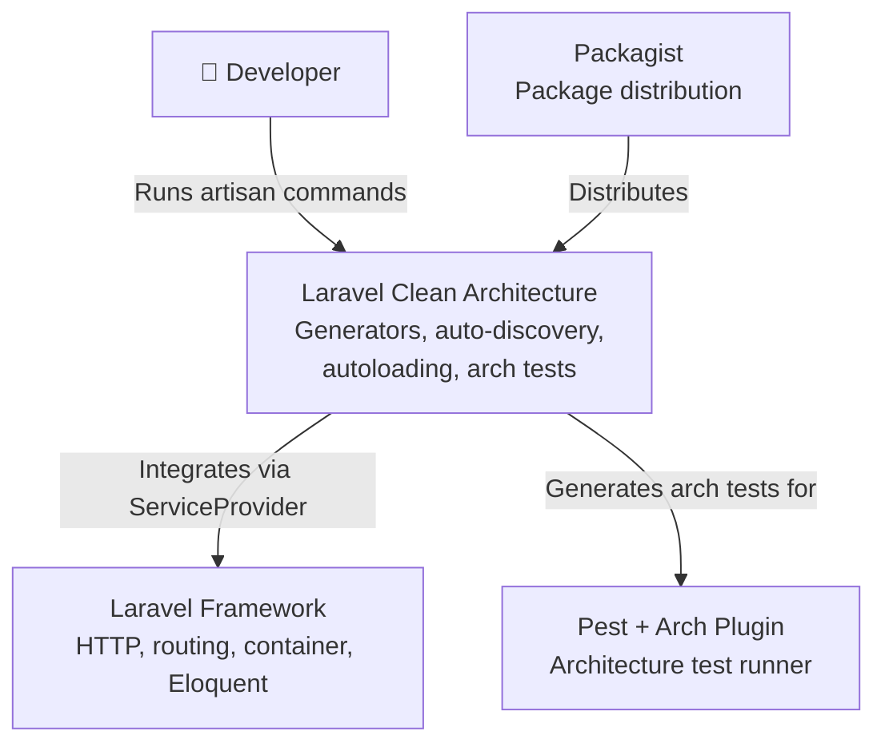
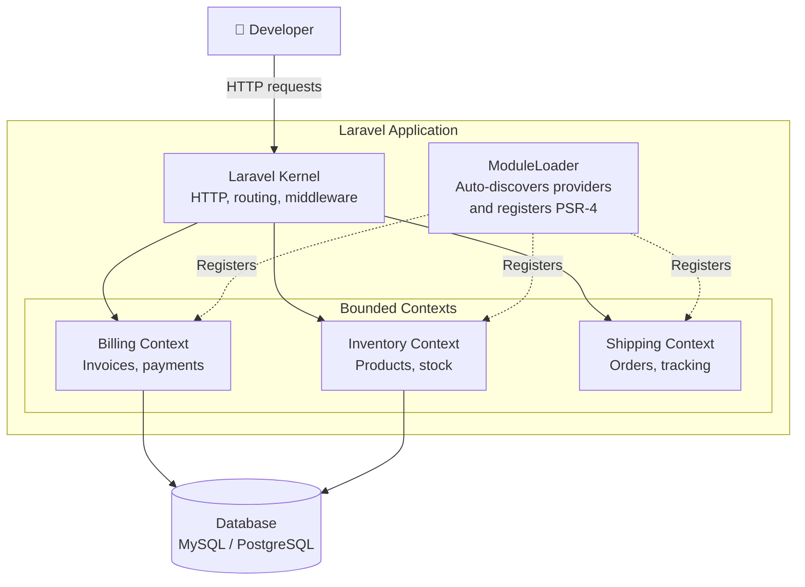
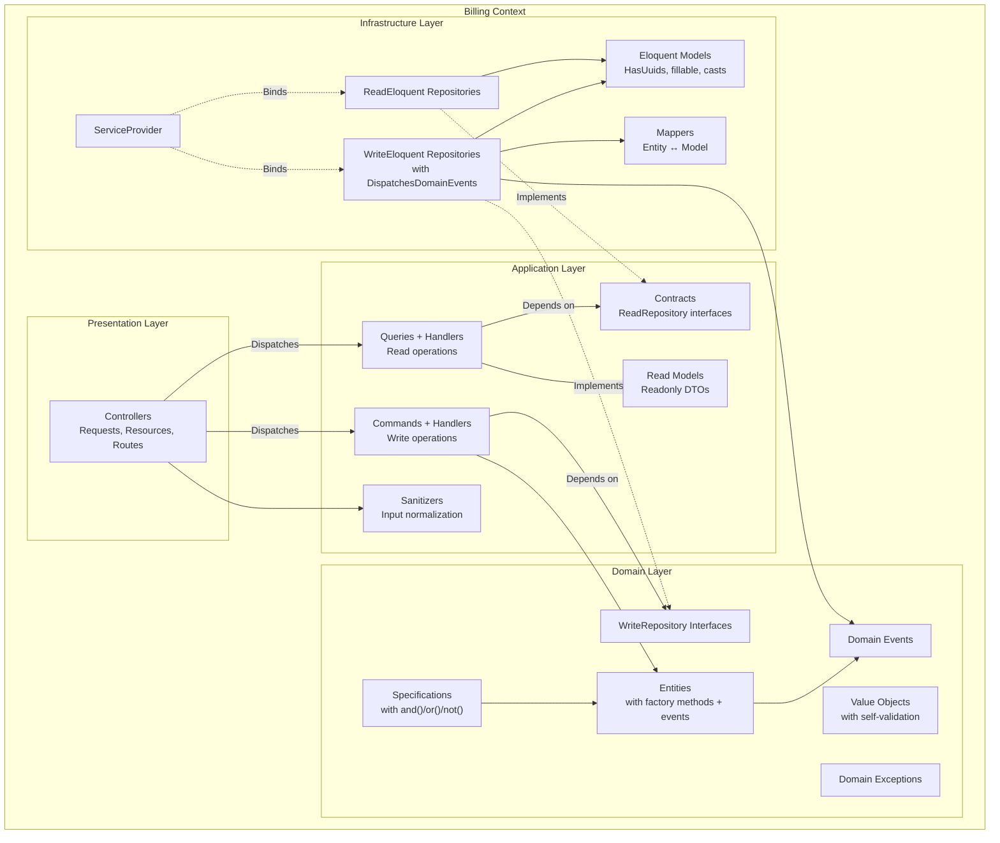
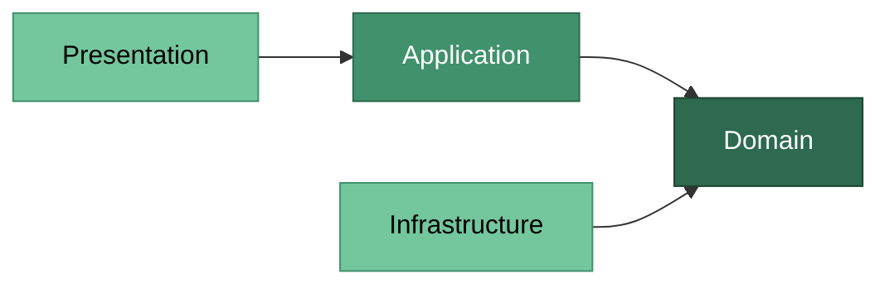

# Laravel Clean Architecture

[](https://github.com/ElberCanoles/laravel-clean-architecture/actions)
[](LICENSE)
[](https://php.net)
[](https://laravel.com)

A Laravel package that provides scaffolding for **Domain-Driven Design (DDD)**, **Clean Architecture**, and **CQRS**. It generates bounded contexts with separated read/write repositories, domain events, mappers, sanitizers, and architecture tests — enforcing clean dependency rules from day one.

---

## Table of Contents

- [Architecture Overview](#architecture-overview)
  - [System Context](#system-context)
  - [Bounded Contexts](#bounded-contexts)
  - [Layers Within a Context](#layers-within-a-context)
- [Architecture Layers](#architecture-layers)
  - [Domain Layer](#domain-layer)
  - [Application Layer](#application-layer)
  - [Infrastructure Layer](#infrastructure-layer)
  - [Presentation Layer](#presentation-layer)
- [The Dependency Rule](#the-dependency-rule)
- [Installation](#installation)
- [Quick Start](#quick-start)
- [Commands Reference](#commands-reference)
- [Configuration](#configuration)
- [Auto-discovery and Autoloading](#auto-discovery-and-autoloading)
- [Architecture Tests](#architecture-tests)
- [Customizing Stubs](#customizing-stubs)
- [Requirements](#requirements)
- [License](#license)

---

## Architecture Overview

This package implements a layered architecture based on the principles of **Clean Architecture** (Robert C. Martin) and **Domain-Driven Design** (Eric Evans). The following diagrams illustrate how the pieces fit together.

### System Context

How the package fits into the Laravel ecosystem:



### Bounded Contexts

How multiple bounded contexts coexist inside a Laravel application:



### Layers Within a Context

The internal structure of a single bounded context and how layers communicate:



---

## Architecture Layers

Each bounded context is divided into four layers with strict dependency rules. The inner layers know nothing about the outer layers.

### Domain Layer

The **heart of the system**. Contains pure business logic with zero dependencies on frameworks, databases, or external services.

```
src/{Context}/Domain/
├── Entities/
├── ValueObjects/
├── Repositories/       # WriteRepository interfaces only
├── Specifications/
├── Events/
└── Exceptions/
```

#### Entities

Core business objects with a **unique identity** that persists over time. Two entities are equal if they share the same id, regardless of their attributes.

```php
namespace Src\Billing\Domain\Entities;

final class Invoice
{
    private array $domainEvents = [];

    public function __construct(
        private readonly string $id,
    ) {
    }

    public static function create(string $id): self
    {
        return new self($id);
    }

    public function id(): string
    {
        return $this->id;
    }

    protected function recordEvent(object $event): void
    {
        $this->domainEvents[] = $event;
    }

    public function releaseEvents(): array
    {
        $events = $this->domainEvents;
        $this->domainEvents = [];
        return $events;
    }
}
```

| Characteristic | Rule |
|---------------|------|
| Identity | Every entity has a unique `id` |
| Factory method | `create()` — named constructor for expressive creation |
| Events | `recordEvent()` / `releaseEvents()` — collect domain events for dispatch |
| Keyword | `final class` — prevents inheritance to protect invariants |
| Dependencies | None outside Domain layer |

#### Value Objects

**Immutable** objects defined by their attributes, not by an identity. Two value objects are equal if all their properties match.

```php
namespace Src\Billing\Domain\ValueObjects;

readonly class Money
{
    public function __construct(
        public string $value,
    ) {
        if (trim($value) === '') {
            throw new \InvalidArgumentException('Money cannot be empty.');
        }
    }

    public function equals(self $other): bool
    {
        return $this->value === $other->value;
    }

    public function __toString(): string
    {
        return $this->value;
    }
}
```

| Characteristic | Rule |
|---------------|------|
| Immutability | `readonly class` — cannot be modified after creation |
| Self-validation | Constructor rejects invalid state immediately |
| Equality | Compared by value via `equals()`, not by reference |
| Dependencies | None outside Domain layer |

#### Repository Interfaces (CQRS Split)

Repositories follow the **CQRS pattern**: write operations are separated from read operations. The **WriteRepository** lives in Domain, the **ReadRepository** lives in Application/Contracts.

```php
// Domain/Repositories — write operations only
namespace Src\Billing\Domain\Repositories;

use Src\Billing\Domain\Entities\Invoice;

interface InvoiceWriteRepository
{
    public function save(Invoice $entity): void;
    public function delete(string $id): void;
}
```

```php
// Application/Contracts — read operations, returns ReadModels
namespace Src\Billing\Application\Contracts;

use Src\Billing\Application\ReadModels\InvoiceReadModel;

interface InvoiceReadRepository
{
    public function findById(string $id): ?InvoiceReadModel;

    /** @return InvoiceReadModel[] */
    public function findAll(int $page = 1, int $perPage = 15): array;
}
```

| Characteristic | Rule |
|---------------|------|
| Type | `interface` — never a concrete class in Domain |
| Write | `save`, `delete` — works with entities |
| Read | `findById`, `findAll` (with pagination) — returns read models |
| Purpose | Decouples domain from persistence + enforces CQRS |
| Implementation | Lives in Infrastructure layer (Eloquent, API, etc.) |

#### Specifications

**Business rules as reusable, composable objects**. Each specification answers a single yes/no question about a domain object.

```php
namespace Src\Billing\Domain\Specifications;

class InvoiceOverdueSpecification
{
    public function isSatisfiedBy(mixed $candidate): bool
    {
        // Business rule: is this invoice past its due date?
    }

    public function and(self $other): static { /* ... */ }
    public function or(self $other): static { /* ... */ }
    public function not(): static { /* ... */ }
}

// Compose specifications:
// $overdue->and($highValue)->or($flagged->not())
```

| Characteristic | Rule |
|---------------|------|
| Single rule | One specification = one business predicate |
| Composable | Specifications can be combined (and, or, not) |
| Reusable | Used by entities, handlers, or query filters |
| Dependencies | May depend on other Domain objects only |

---

### Application Layer

**Orchestrates use cases** by coordinating domain objects. Contains no business logic itself — it delegates to the Domain layer.

```
src/{Context}/Application/
├── Commands/
│   └── {Name}/
│       ├── {Name}Command.php
│       └── {Name}Handler.php
├── Queries/
│   └── {Name}/
│       ├── {Name}Query.php
│       └── {Name}Handler.php
├── Contracts/          # ReadRepository interfaces
├── ReadModels/         # Read models (readonly DTOs)
└── Sanitizers/         # Input sanitization
```

#### Commands (Write Operations)

A **Command** represents an intention to change state. It is a simple DTO (Data Transfer Object) carrying the data needed for the operation. The **Handler** executes the use case. The `--crud` flag generates CRUD-specific constructors and handler bodies.

```php
// Create command — receives sanitized data array
readonly class CreateInvoiceCommand
{
    public function __construct(
        public array $data,
    ) {
    }
}

// Create handler — creates entity via factory method, saves via repository
class CreateInvoiceHandler
{
    public function __construct(
        private readonly InvoiceWriteRepository $repository,
    ) {
    }

    public function handle(CreateInvoiceCommand $command): void
    {
        $entity = Invoice::create(Str::uuid()->toString());
        $this->repository->save($entity);
    }
}
```

```php
// Delete command — receives entity id
readonly class DeleteInvoiceCommand
{
    public function __construct(
        public string $id,
    ) {
    }
}

// Delete handler — delegates to repository
class DeleteInvoiceHandler
{
    public function __construct(
        private readonly InvoiceWriteRepository $repository,
    ) {
    }

    public function handle(DeleteInvoiceCommand $command): void
    {
        $this->repository->delete($command->id);
    }
}
```

| Component | Responsibility |
|-----------|---------------|
| `Command` | Immutable DTO with input data (what to do) |
| `Handler` | Executes the use case (how to do it) |
| Return | `void` — commands don't return data |
| `--crud` | Generates CRUD-specific constructor + handler body |

#### Queries (Read Operations)

A **Query** represents a request for data. The **Handler** fetches and returns a **ReadModel** — a flat, optimized representation of the data.

```php
// Query — immutable DTO with query parameters
namespace Src\Billing\Application\Queries\GetInvoice;

readonly class GetInvoiceQuery
{
    public function __construct(
        public string $id,
    ) {
    }
}

// Handler — fetches data via ReadRepository, injected via --entity flag
namespace Src\Billing\Application\Queries\GetInvoice;

use Src\Billing\Application\Contracts\InvoiceReadRepository;
use Src\Billing\Application\ReadModels\InvoiceReadModel;

class GetInvoiceHandler
{
    public function __construct(
        private readonly InvoiceReadRepository $repository,
    ) {
    }

    public function handle(GetInvoiceQuery $query): ?InvoiceReadModel
    {
        return $this->repository->findById($query->id);
    }
}
```

| Component | Responsibility |
|-----------|---------------|
| `Query` | DTO with query parameters (filters, pagination) |
| `Handler` | Fetches data, builds and returns a ReadModel from `Application/ReadModels/` |
| `ReadModel` | Readonly DTO optimized for the consumer (one per entity) |

For collection/list queries, the `--collection` flag generates a paginated variant:

```php
// List query — pagination instead of $id
namespace Src\Billing\Application\Queries\ListInvoices;

readonly class ListInvoicesQuery
{
    public function __construct(
        public int $page = 1,
        public int $perPage = 15,
    ) {
    }
}

// Handler — returns array of read models with pagination passthrough
class ListInvoicesHandler
{
    public function __construct(
        private readonly InvoiceReadRepository $repository,
    ) {
    }

    /** @return InvoiceReadModel[] */
    public function handle(ListInvoicesQuery $query): array
    {
        return $this->repository->findAll($query->page, $query->perPage);
    }
}
```

#### Read Models

Read models in `Application/ReadModels/` are **reusable projections** shared across queries.

```php
namespace Src\Billing\Application\ReadModels;

readonly class InvoiceSummaryReadModel
{
    public function __construct(
        public string $id,
    ) {
    }
}
```

---

### Infrastructure Layer

**Implements interfaces** defined in the Domain layer. This is where frameworks, databases, APIs, and other external concerns live.

```
src/{Context}/Infrastructure/
├── {Context}ServiceProvider.php
├── Models/
│   └── {Name}Model.php
├── {Name}WriteEloquentRepository.php
├── {Name}ReadEloquentRepository.php
└── {Name}Mapper.php
```

#### Eloquent Repositories (CQRS)

Separate implementations for write and read operations:

```php
// Write — works with entities, dispatches domain events after persistence
namespace Src\Billing\Infrastructure;

use CleanArchitecture\Support\DispatchesDomainEvents;
use Src\Billing\Domain\Entities\Invoice;
use Src\Billing\Domain\Repositories\InvoiceWriteRepository;
use Src\Billing\Infrastructure\Models\InvoiceModel;

class InvoiceWriteEloquentRepository implements InvoiceWriteRepository
{
    use DispatchesDomainEvents;

    public function save(Invoice $entity): void
    {
        $data = InvoiceMapper::toArray($entity);
        InvoiceModel::query()->updateOrCreate(['id' => $entity->id()], $data);
        $this->dispatchDomainEvents($entity);
    }

    public function delete(string $id): void
    {
        InvoiceModel::destroy($id);
    }
}
```

```php
// Read — returns read models via mapper
namespace Src\Billing\Infrastructure;

use Src\Billing\Application\Contracts\InvoiceReadRepository;
use Src\Billing\Application\ReadModels\InvoiceReadModel;
use Src\Billing\Infrastructure\Models\InvoiceModel;

class InvoiceReadEloquentRepository implements InvoiceReadRepository
{
    public function findById(string $id): ?InvoiceReadModel
    {
        $model = InvoiceModel::query()->find($id);

        return $model ? new InvoiceReadModel($model->id) : null;
    }

    /** @return InvoiceReadModel[] */
    public function findAll(int $page = 1, int $perPage = 15): array
    {
        return InvoiceModel::query()
            ->forPage($page, $perPage)
            ->get()
            ->map(fn (InvoiceModel $model) => new InvoiceReadModel($model->id))
            ->all();
    }
}
```

#### Eloquent Model

Each scaffolded entity gets a dedicated Eloquent model with UUID support. Table names are auto-computed from the entity name (`OrderItem` → `order_items`).

```php
namespace Src\Billing\Infrastructure\Models;

use Illuminate\Database\Eloquent\Concerns\HasUuids;
use Illuminate\Database\Eloquent\Model;

class InvoiceModel extends Model
{
    use HasUuids;

    protected $table = 'invoices';

    protected $fillable = [
        'id',
        // TODO: Add fillable columns
    ];
}
```

#### Mapper

Bridges the gap between entities and Eloquent models:

```php
namespace Src\Billing\Infrastructure;

use Src\Billing\Infrastructure\Models\InvoiceModel;

final class InvoiceMapper
{
    public static function toArray(Invoice $entity): array
    {
        return ['id' => $entity->id(), /* ... */];
    }

    public static function toEntity(InvoiceModel $model): Invoice
    {
        return new Invoice(id: $model->id, /* ... */);
    }
}
```

#### Context ServiceProvider

Each bounded context has its own ServiceProvider where you **bind repository interfaces to implementations**. Routes are **automatically loaded** from `Presentation/Routes/` — both `api.php` and `web.php` are loaded if they exist. When you run `clean:scaffold`, bindings are **wired automatically** between the `// {bindings}` markers.

```php
namespace Src\Billing\Infrastructure;

class BillingServiceProvider extends ServiceProvider
{
    public function register(): void
    {
        // This provider is auto-discovered by the CleanArchitecture package.
        // No manual registration in bootstrap/providers.php is needed.

        // {bindings}
        $this->app->bind(InvoiceWriteRepository::class, InvoiceWriteEloquentRepository::class);
        $this->app->bind(InvoiceReadRepository::class, InvoiceReadEloquentRepository::class);
        // {/bindings}
    }

    public function boot(): void
    {
        $this->loadRoutes();  // loads api.php + web.php if they exist
    }
}
```

#### Domain Event Dispatching

Write repositories include the `DispatchesDomainEvents` trait, which dispatches domain events via Laravel's `event()` helper after entity persistence. Events recorded via `$entity->recordEvent()` are released and dispatched automatically when `save()` is called. The `releaseEvents()` method clears the entity's event list, preventing double dispatch.

```php
// In your entity:
$invoice->recordEvent(new InvoicePaidEvent($invoice->id()));

// In your write repository (generated automatically):
$this->dispatchDomainEvents($entity); // called after save

// Listen with standard Laravel listeners:
Event::listen(InvoicePaidEvent::class, SendInvoiceReceipt::class);
```

The trait uses a `method_exists()` guard, so it works safely with any entity — even those that don't implement domain events.

---

### Presentation Layer

**Entry point for external input**. Contains controllers, form requests, API resources, and route definitions. Delegates all logic to the Application layer.

```
src/{Context}/Presentation/
├── Controllers/
├── Requests/
├── Resources/
└── Routes/
    ├── api.php          # generated by default
    └── web.php          # generated with --routes=web or --routes=both
```

#### Controllers

Handle HTTP requests and delegate to Application layer commands/queries. When generated via `clean:scaffold` or `clean:controller --entity`, the controller comes **pre-wired** with all 5 CQRS handlers and working implementations for every RESTful method:

```php
namespace Src\Billing\Presentation\Controllers;

use Src\Billing\Application\Commands\CreateInvoice\{CreateInvoiceCommand, CreateInvoiceHandler};
use Src\Billing\Application\Commands\UpdateInvoice\{UpdateInvoiceCommand, UpdateInvoiceHandler};
use Src\Billing\Application\Commands\DeleteInvoice\{DeleteInvoiceCommand, DeleteInvoiceHandler};
use Src\Billing\Application\Queries\GetInvoice\{GetInvoiceHandler, GetInvoiceQuery};
use Src\Billing\Application\Queries\ListInvoices\{ListInvoicesHandler, ListInvoicesQuery};
use Src\Billing\Application\Sanitizers\InvoiceSanitizer;

class InvoiceController extends Controller
{
    public function __construct(
        private readonly CreateInvoiceHandler $createHandler,
        private readonly UpdateInvoiceHandler $updateHandler,
        private readonly DeleteInvoiceHandler $deleteHandler,
        private readonly GetInvoiceHandler $getHandler,
        private readonly ListInvoicesHandler $listHandler,
    ) {
    }

    public function index(): JsonResponse
    {
        $readModels = $this->listHandler->handle(new ListInvoicesQuery());
        return InvoiceResource::collection($readModels)->response();
    }

    public function show(string $id): JsonResponse
    {
        $readModel = $this->getHandler->handle(new GetInvoiceQuery($id));
        abort_if(! $readModel, 404);

        return (new InvoiceResource($readModel))->response();
    }

    public function store(InvoiceRequest $request): JsonResponse
    {
        $sanitized = InvoiceSanitizer::sanitize($request->validated());
        $this->createHandler->handle(new CreateInvoiceCommand($sanitized));
        return response()->json([], 201);
    }

    public function update(InvoiceRequest $request, string $id): JsonResponse
    {
        $sanitized = InvoiceSanitizer::sanitize($request->validated());
        $this->updateHandler->handle(new UpdateInvoiceCommand($id, $sanitized));
        return response()->json([]);
    }

    public function destroy(string $id): JsonResponse
    {
        $this->deleteHandler->handle(new DeleteInvoiceCommand($id));
        return response()->json([], 204);
    }
}
```

Without `--entity`, the controller generates with TODO placeholders for all methods.

#### Form Requests

Validate incoming HTTP data before it reaches the Application layer.

```php
namespace Src\Billing\Presentation\Requests;

use Illuminate\Foundation\Http\FormRequest;

class InvoiceRequest extends FormRequest
{
    public function authorize(): bool
    {
        // TODO: Implement authorization
        return true;
    }

    public function rules(): array
    {
        return [
            // 'name' => ['required', 'string', 'max:255'],
        ];
    }
}
```

#### API Resources

Transform read models into JSON responses:

```php
namespace Src\Billing\Presentation\Resources;

use Illuminate\Http\Resources\Json\JsonResource;

class InvoiceResource extends JsonResource
{
    public function toArray($request): array
    {
        return [
            'id' => $this->id,
            // 'name' => $this->name,
            // 'created_at' => $this->created_at?->toISOString(),
        ];
    }
}
```

#### Routes

Each context has its own route files at `Presentation/Routes/`, automatically loaded by the context's ServiceProvider. Both `api.php` (with `api` middleware) and `web.php` (with `web` middleware) are loaded if they exist. The route prefix is derived from the context name in kebab-case.

When you run `clean:scaffold`, an `apiResource` route is **wired automatically** between the `// {routes}` markers:

```php
// src/Billing/Presentation/Routes/api.php
use Illuminate\Support\Facades\Route;
use Src\Billing\Presentation\Controllers\InvoiceController;

Route::prefix('billing')->group(function () {
    // {routes}
    Route::apiResource('invoices', InvoiceController::class);
    // {/routes}
});
```

For a multi-word context like `OrderManagement`, the prefix becomes `order-management`. Use `--routes=web` or `--routes=both` with `clean:context` to generate web route files.

---

## The Dependency Rule

The most important rule in Clean Architecture: **dependencies only point inward**.



| Rule | Enforced by |
|------|-------------|
| Domain does not depend on Application | Architecture test |
| Domain does not depend on Infrastructure | Architecture test |
| Application does not depend on Presentation | Architecture test |
| Application does not depend on Infrastructure | Architecture test |
| Entities are `final` | Architecture test |
| Repository interfaces are `interface` | Architecture test |
| Value Objects are `readonly` | Architecture test |
| Infrastructure implements Domain interfaces | Convention (stubs) |

The generated architecture tests **automatically enforce these rules** in your CI pipeline.

---

## Installation

```bash
composer require elber/laravel-clean-architecture
```

The ServiceProvider is auto-discovered by Laravel. No manual registration needed.

### Publish config (optional)

```bash
php artisan vendor:publish --tag=clean-architecture-config
```

### Publish stubs for customization (optional)

```bash
php artisan vendor:publish --tag=clean-architecture-stubs
```

---

## Quick Start

### Option A: Scaffold everything at once

```bash
# 1. Create the Billing context (folders + ServiceProvider + routes + arch tests)
php artisan clean:context Billing

# 2. Scaffold a full entity with all layers in one command
php artisan clean:scaffold Billing Invoice
```

This generates **22 fully wired files**: entity, Eloquent model (`HasUuids`), CQRS repositories (write + read with real Eloquent code and pagination), mapper, read model, commands (`CreateInvoice` with `array $data`, `UpdateInvoice` with `string $id` + `array $data`, `DeleteInvoice` with `string $id`) with CRUD-specific handlers, queries (`GetInvoice` with nullable return, `ListInvoices` with pagination passthrough) with handlers wired to `InvoiceReadRepository`, controller with all 5 handlers injected and working `index()`/`show()`/`store()`/`update()`/`destroy()` methods (including `abort_if` null handling in `show()`), request, resource, and sanitizer. Write repositories dispatch domain events automatically after persistence. If a bounded context exists, the scaffold also **wires the ServiceProvider bindings** and **registers an `apiResource` route** automatically.

### Option B: Generate piece by piece

```bash
# 1. Create the Billing context
php artisan clean:context Billing

# 2. Generate domain objects
php artisan clean:entity Billing Invoice
php artisan clean:value-object Billing Money
php artisan clean:repository Billing Invoice      # generates Write + Read repos, Eloquent impls, and mapper
php artisan clean:read-model Billing Invoice       # standalone read model
php artisan clean:specification Billing InvoiceOverdue
php artisan clean:domain-event Billing InvoicePaid
php artisan clean:exception Billing InvoiceNotFound

# 3. Generate CQRS use cases (--entity wires repository injection, --crud wires handler body)
php artisan clean:command Billing CreateInvoice --entity=Invoice --crud=create
php artisan clean:command Billing PayInvoice --entity=Invoice
php artisan clean:query Billing GetInvoice --entity=Invoice

# 4. Generate presentation layer (--entity wires CQRS handlers in controller)
php artisan clean:controller Billing Invoice --entity=Invoice
php artisan clean:request Billing Invoice
php artisan clean:resource Billing Invoice
php artisan clean:sanitizer Billing Invoice

# 5. Generate a unit test
php artisan clean:test Billing Invoice
```

Result:

```
src/Billing/
├── Domain/
│   ├── Entities/
│   │   └── Invoice.php                        # with factory method + domain events
│   ├── ValueObjects/
│   │   └── Money.php                          # with self-validation
│   ├── Repositories/
│   │   └── InvoiceWriteRepository.php         # interface (write only)
│   ├── Specifications/
│   │   └── InvoiceOverdueSpecification.php    # with and()/or()/not()
│   ├── Events/
│   │   └── InvoicePaidEvent.php               # readonly with timestamp
│   └── Exceptions/
│       └── InvoiceNotFoundException.php
├── Application/
│   ├── Commands/
│   │   ├── CreateInvoice/
│   │   │   ├── CreateInvoiceCommand.php       # readonly DTO
│   │   │   └── CreateInvoiceHandler.php       # injects WriteRepository
│   │   ├── UpdateInvoice/
│   │   │   ├── UpdateInvoiceCommand.php
│   │   │   └── UpdateInvoiceHandler.php
│   │   └── DeleteInvoice/
│   │       ├── DeleteInvoiceCommand.php
│   │       └── DeleteInvoiceHandler.php
│   ├── Queries/
│   │   ├── GetInvoice/
│   │   │   ├── GetInvoiceQuery.php            # readonly DTO with $id
│   │   │   └── GetInvoiceHandler.php          # returns ReadModel
│   │   └── ListInvoices/
│   │       ├── ListInvoicesQuery.php          # with $page, $perPage
│   │       └── ListInvoicesHandler.php        # returns ReadModel[]
│   ├── Contracts/
│   │   └── InvoiceReadRepository.php          # interface (read only)
│   ├── ReadModels/
│   │   └── InvoiceReadModel.php               # shared across queries
│   └── Sanitizers/
│       └── InvoiceSanitizer.php
├── Infrastructure/
│   ├── BillingServiceProvider.php             # with auto-wired bindings
│   ├── Models/
│   │   └── InvoiceModel.php                   # HasUuids Eloquent model
│   ├── InvoiceWriteEloquentRepository.php     # dispatches domain events
│   ├── InvoiceReadEloquentRepository.php
│   └── InvoiceMapper.php                      # Entity ↔ Model bridge
└── Presentation/
    ├── Controllers/
    │   └── InvoiceController.php              # all 5 CQRS handlers wired
    ├── Requests/
    │   └── InvoiceRequest.php
    ├── Resources/
    │   └── InvoiceResource.php                # with field mapping
    └── Routes/
        └── api.php

tests/Feature/Architecture/
└── BillingArchTest.php                        # 7 dependency rules

tests/Unit/Domain/Billing/
└── InvoiceTest.php                            # entity unit test
```

---

## Commands Reference

All commands support the `--force` flag to overwrite existing files.

| Command | Description | Output |
|---------|-------------|--------|
| `clean:context {name} [--routes=]` | Create bounded context with folders, ServiceProvider, routes, arch tests | Full folder structure |
| `clean:scaffold {context} {name}` | Scaffold full CRUD entity across all layers (wires controller, SP bindings, routes) | 22+ files |
| `clean:entity {context} {name}` | Domain entity with factory method and event recording | `Domain/Entities/{Name}.php` |
| `clean:model {context} {name}` | Eloquent model with HasUuids and auto-computed table name | `Infrastructure/Models/{Name}Model.php` |
| `clean:repository {context} {name}` | CQRS repositories (Write + Read interfaces, Eloquent impls, mapper) | 5 files |
| `clean:read-model {context} {name}` | Standalone readonly read model | `Application/ReadModels/{Name}ReadModel.php` |
| `clean:value-object {context} {name}` | Readonly value object with validation | `Domain/ValueObjects/{Name}.php` |
| `clean:specification {context} {name}` | Composable specification with `and()`/`or()`/`not()` | `Domain/Specifications/{Name}Specification.php` |
| `clean:domain-event {context} {name}` | Readonly domain event with timestamp | `Domain/Events/{Name}Event.php` |
| `clean:exception {context} {name}` | Domain exception extending `\DomainException` | `Domain/Exceptions/{Name}Exception.php` |
| `clean:command {context} {name} [--entity=] [--crud=]` | CQRS command + handler (optionally injects WriteRepository with CRUD-specific logic) | `Application/Commands/{Name}/` |
| `clean:query {context} {name} [--entity=] [--collection]` | CQRS query + handler (optionally injects ReadRepository) | `Application/Queries/{Name}/` |
| `clean:mapper {context} {name}` | Entity-Model mapper | `Infrastructure/{Name}Mapper.php` |
| `clean:sanitizer {context} {name}` | Input sanitizer | `Application/Sanitizers/{Name}Sanitizer.php` |
| `clean:controller {context} {name} [--entity=]` | Controller with full CRUD dispatch pattern (optionally wires all 5 handlers) | `Presentation/Controllers/{Name}Controller.php` |
| `clean:request {context} {name}` | Form request with authorization | `Presentation/Requests/{Name}Request.php` |
| `clean:resource {context} {name}` | API resource with field mapping | `Presentation/Resources/{Name}Resource.php` |
| `clean:test {context} {name}` | Pest unit test for domain entity | `tests/Unit/Domain/{Context}/{Name}Test.php` |
| `clean:arch-test {context}` | Architecture dependency tests | `tests/Feature/Architecture/{Context}ArchTest.php` |

### The `--entity` flag

The `clean:command`, `clean:query`, and `clean:controller` commands accept an optional `--entity` flag that automatically wires the generated code:

```bash
# Handler will inject InvoiceWriteRepository
php artisan clean:command Billing PayInvoice --entity=Invoice

# Handler will inject InvoiceReadRepository
php artisan clean:query Billing GetInvoice --entity=Invoice

# Controller will inject all 5 handlers (create, update, delete, get, list)
php artisan clean:controller Billing Invoice --entity=Invoice
```

Without `--entity`, the generated files get TODO placeholders instead. The `clean:scaffold` command passes `--entity` automatically.

### The `--crud` flag

The `clean:command` command accepts a `--crud` flag that generates CRUD-specific command constructors and handler bodies:

```bash
# Constructor: array $data — Handler: Entity::create() + repository->save()
php artisan clean:command Billing CreateInvoice --entity=Invoice --crud=create

# Constructor: string $id + array $data — Handler: TODO (load entity, apply changes)
php artisan clean:command Billing UpdateInvoice --entity=Invoice --crud=update

# Constructor: string $id — Handler: repository->delete($command->id)
php artisan clean:command Billing DeleteInvoice --entity=Invoice --crud=delete
```

| `--crud` value | Constructor | Handler body |
|---------------|-------------|-------------|
| `create` | `public array $data` | Creates entity via factory method + saves |
| `update` | `public string $id, public array $data` | TODO: load, apply changes, persist |
| `delete` | `public string $id` | `$this->repository->delete($command->id)` |
| _(none)_ | `public string $id` | TODO placeholder |

The `clean:scaffold` command passes `--crud` automatically to each command (`create`, `update`, `delete`).

### The `--collection` flag

The `clean:query` command accepts a `--collection` flag to generate a list/collection query with pagination parameters instead of a single-entity query:

```bash
# Generates query with $page/$perPage params and handler returning array
php artisan clean:query Billing ListInvoices --entity=Invoice --collection
```

The `clean:scaffold` command uses this flag automatically for the `ListEntities` query.

### The `--routes` flag

The `clean:context` command accepts an optional `--routes` flag to control which route files are generated:

```bash
php artisan clean:context Billing                  # generates api.php (default)
php artisan clean:context Billing --routes=web     # generates web.php
php artisan clean:context Billing --routes=both    # generates api.php + web.php
```

The ServiceProvider loads both `api.php` and `web.php` automatically if they exist, applying the corresponding middleware.

---

## Configuration

| Option | Default | Description |
|--------|---------|-------------|
| `contexts_path` | `src` | Directory where bounded contexts live, relative to `base_path()` |
| `namespace_prefix` | `Src` | Root namespace for contexts (`Src\Billing`, `Src\Inventory`, etc.) |
| `auto_discover` | `true` | Auto-register `{Context}ServiceProvider` from each context |
| `auto_load` | `true` | Auto-register PSR-4 autoloading for all `src/` contexts |
| `arch_tests_path` | `tests/Feature/Architecture` | Where generated architecture tests are stored |
| `unit_tests_path` | `tests/Unit/Domain` | Where generated domain unit tests are stored |

---

## Auto-discovery and Autoloading

### ServiceProvider Auto-discovery

When `auto_discover` is enabled, the package scans each bounded context for a ServiceProvider at:

```
src/{Context}/Infrastructure/{Context}ServiceProvider.php
```

These providers are **automatically registered** with Laravel's service container. The `clean:context` command generates this ServiceProvider for you.

### PSR-4 Autoloading

When `auto_load` is enabled, the package registers PSR-4 autoloading for every directory in your contexts path:

```
Src\Billing\    --> src/Billing/
Src\Inventory\  --> src/Inventory/
Src\Shipping\   --> src/Shipping/
```

**No manual `composer.json` changes needed** when you add new bounded contexts.

---

## Architecture Tests

The `clean:context` and `clean:arch-test` commands generate Pest architecture tests that **enforce DDD dependency rules** automatically.

Generated tests for each context (7 rules):

| Test | What it enforces |
|------|-----------------|
| Domain does not depend on Infrastructure | Domain layer has zero external dependencies |
| Domain does not depend on Application | Domain never calls use cases or handlers |
| Application does not depend on Presentation | Use cases never reference controllers or requests |
| Application does not depend on Infrastructure | Use cases never reference Eloquent or providers |
| Entities are final classes | Prevents inheritance that could break invariants |
| Repositories in Domain are interfaces | Domain defines contracts, never implementations |
| Value Objects are readonly | Guarantees immutability |

Run them with:

```bash
vendor/bin/pest tests/Feature/Architecture/
```

These tests integrate into your CI pipeline and **fail the build** if anyone introduces a dependency rule violation.

---

## Customizing Stubs

Publish the stubs to your project:

```bash
php artisan vendor:publish --tag=clean-architecture-stubs
```

This copies all stubs to `stubs/clean-architecture/`. Edit them to match your team's conventions. The generators will use your custom stubs instead of the defaults.

Available stubs:

| Stub | Used by | Placeholders |
|------|---------|-------------|
| `entity.stub` | `clean:entity` | `{{Namespace}}`, `{{Class}}` |
| `model.stub` | `clean:model` | `{{Namespace}}`, `{{Class}}`, `{{table}}` |
| `write-repository.stub` | `clean:repository` | `{{Namespace}}`, `{{Class}}` |
| `read-repository.stub` | `clean:repository` | `{{Namespace}}`, `{{Class}}` |
| `write-eloquent-repository.stub` | `clean:repository` | `{{Namespace}}`, `{{Class}}` |
| `read-eloquent-repository.stub` | `clean:repository` | `{{Namespace}}`, `{{Class}}` |
| `mapper.stub` | `clean:repository`, `clean:mapper` | `{{Namespace}}`, `{{Class}}` |
| `value-object.stub` | `clean:value-object` | `{{Namespace}}`, `{{Class}}` |
| `specification.stub` | `clean:specification` | `{{Namespace}}`, `{{Class}}` |
| `read-model.stub` | `clean:read-model` | `{{Namespace}}`, `{{Class}}` |
| `command.stub` | `clean:command` | `{{Namespace}}`, `{{Class}}`, `{{CommandConstructor}}` |
| `command-handler.stub` | `clean:command` | `{{Namespace}}`, `{{Class}}`, `{{EntityImport}}`, `{{EntityConstructor}}`, `{{HandlerBody}}` |
| `query.stub` | `clean:query` | `{{Namespace}}`, `{{Class}}` |
| `query-handler.stub` | `clean:query` | `{{Namespace}}`, `{{Class}}`, `{{EntityImport}}`, `{{EntityConstructor}}`, `{{ReturnType}}`, `{{HandlerBody}}` |
| `list-query.stub` | `clean:query --collection` | `{{Namespace}}`, `{{Class}}` |
| `list-query-handler.stub` | `clean:query --collection` | `{{Namespace}}`, `{{Class}}`, `{{EntityImport}}`, `{{EntityConstructor}}`, `{{ReturnType}}`, `{{HandlerBody}}` |
| `domain-event.stub` | `clean:domain-event` | `{{Namespace}}`, `{{Class}}` |
| `domain-exception.stub` | `clean:exception` | `{{Namespace}}`, `{{Class}}` |
| `sanitizer.stub` | `clean:sanitizer` | `{{Namespace}}`, `{{Class}}` |
| `unit-test.stub` | `clean:test` | `{{Namespace}}`, `{{Class}}` |
| `service-provider.stub` | `clean:context` | `{{Namespace}}`, `{{Context}}`, `// {bindings}` / `// {/bindings}` markers |
| `routes.stub` | `clean:context` | `{{prefix}}`, `// {routes}` / `// {/routes}` markers |
| `controller.stub` | `clean:controller` | `{{Namespace}}`, `{{Class}}`, `{{ControllerImports}}`, `{{ControllerConstructor}}`, `{{IndexBody}}`, `{{ShowBody}}`, `{{StoreBody}}`, `{{UpdateBody}}`, `{{DestroyBody}}` |
| `request.stub` | `clean:request` | `{{Namespace}}`, `{{Class}}` |
| `resource.stub` | `clean:resource` | `{{Namespace}}`, `{{Class}}` |
| `arch-test.stub` | `clean:arch-test` | `{{Namespace}}`, `{{Context}}` |

---

## Requirements

- PHP 8.2+
- Laravel 11.0+ or 12.0+

### Dev dependencies (for architecture tests)

- [Pest](https://pestphp.com/) ^3.0
- [Pest Architecture Plugin](https://pestphp.com/docs/arch-testing) ^3.0

---

## License

This package is open-sourced software licensed under the [MIT License](LICENSE).
