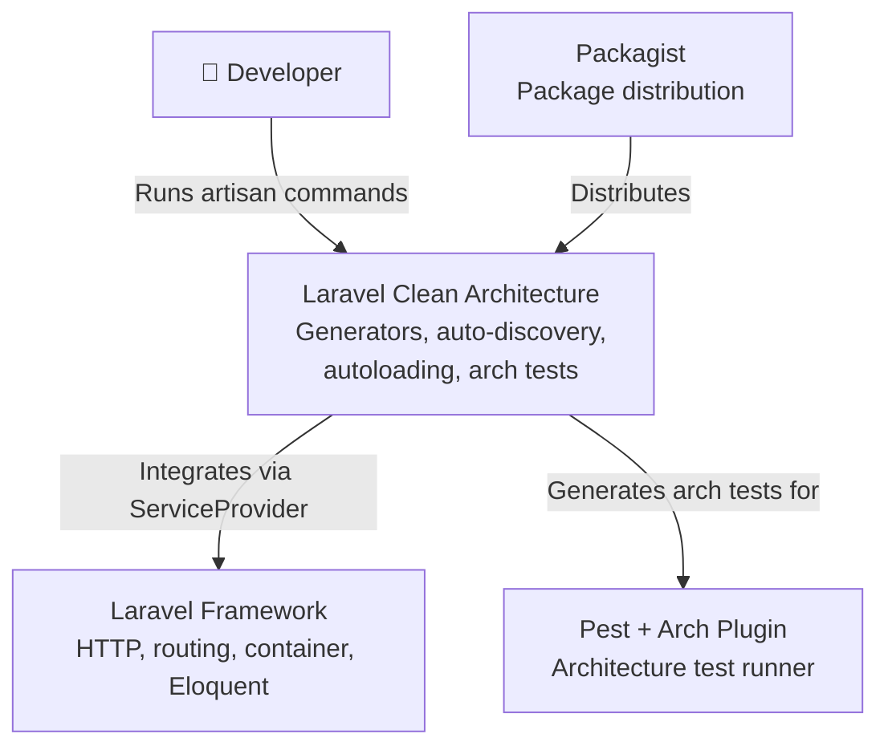
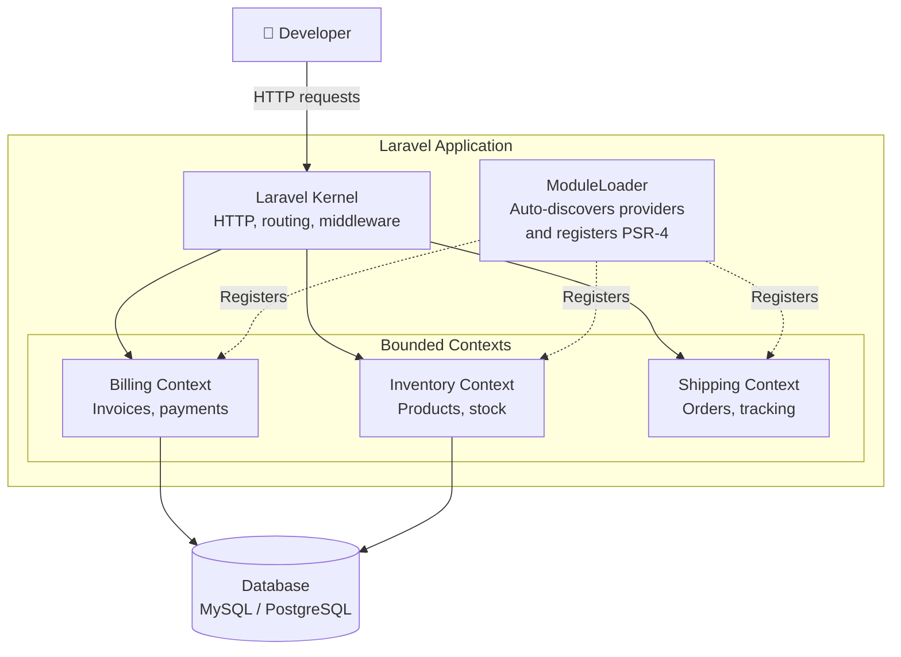
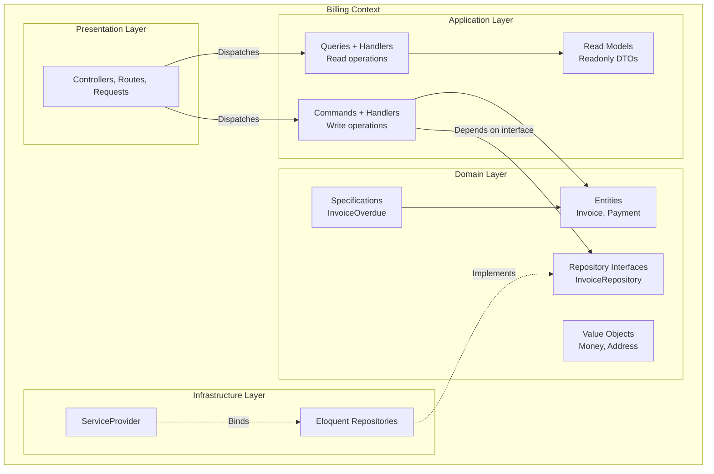
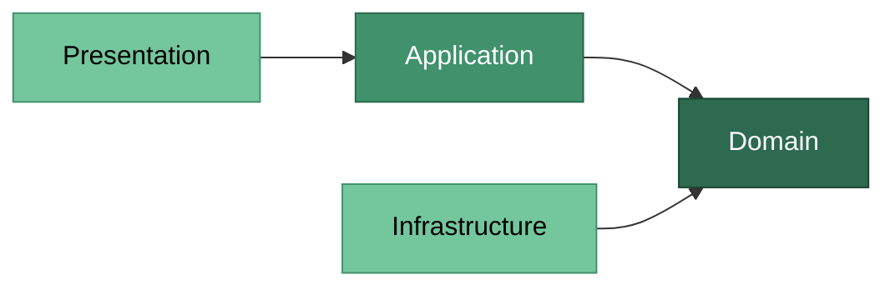

# Laravel Clean Architecture

[](https://github.com/ElberCanoles/laravel-clean-architecture/actions)
[](LICENSE)
[](https://php.net)
[](https://laravel.com)

A Laravel package that provides scaffolding for **Domain-Driven Design (DDD)** and **Clean Architecture**. It generates bounded contexts, entities, repositories, value objects, CQRS commands/queries, and architecture tests — enforcing clean dependency rules from day one.

---

## Table of Contents

- [Architecture Overview](#architecture-overview)
  - [System Context](#system-context)
  - [Bounded Contexts](#bounded-contexts)
  - [Layers Within a Context](#layers-within-a-context)
- [Architecture Layers](#architecture-layers)
  - [Domain Layer](#domain-layer)
  - [Application Layer](#application-layer)
  - [Infrastructure Layer](#infrastructure-layer)
  - [Presentation Layer](#presentation-layer)
- [The Dependency Rule](#the-dependency-rule)
- [Installation](#installation)
- [Quick Start](#quick-start)
- [Commands Reference](#commands-reference)
- [Configuration](#configuration)
- [Auto-discovery and Autoloading](#auto-discovery-and-autoloading)
- [Architecture Tests](#architecture-tests)
- [Customizing Stubs](#customizing-stubs)
- [Requirements](#requirements)
- [License](#license)

---

## Architecture Overview

This package implements a layered architecture based on the principles of **Clean Architecture** (Robert C. Martin) and **Domain-Driven Design** (Eric Evans). The following diagrams illustrate how the pieces fit together.

### System Context

How the package fits into the Laravel ecosystem:



### Bounded Contexts

How multiple bounded contexts coexist inside a Laravel application:



### Layers Within a Context

The internal structure of a single bounded context and how layers communicate:



---

## Architecture Layers

Each bounded context is divided into four layers with strict dependency rules. The inner layers know nothing about the outer layers.

### Domain Layer

The **heart of the system**. Contains pure business logic with zero dependencies on frameworks, databases, or external services.

```
src/{Context}/Domain/
├── Entities/
├── ValueObjects/
├── Repositories/
└── Specifications/
```

#### Entities

Core business objects with a **unique identity** that persists over time. Two entities are equal if they share the same id, regardless of their attributes.

```php
namespace App\Billing\Domain\Entities;

final class Invoice
{
    public function __construct(
        private readonly string $id,
    ) {
    }

    public function id(): string
    {
        return $this->id;
    }
}
```

| Characteristic | Rule |
|---------------|------|
| Identity | Every entity has a unique `id` |
| Mutability | Can change state through domain methods |
| Keyword | `final class` — prevents inheritance to protect invariants |
| Dependencies | None outside Domain layer |

#### Value Objects

**Immutable** objects defined by their attributes, not by an identity. Two value objects are equal if all their properties match.

```php
namespace App\Billing\Domain\ValueObjects;

readonly class Money
{
    public function __construct(
        public string $value,
    ) {
    }

    public function equals(self $other): bool
    {
        return $this->value === $other->value;
    }

    public function __toString(): string
    {
        return $this->value;
    }
}
```

| Characteristic | Rule |
|---------------|------|
| Immutability | `readonly class` — cannot be modified after creation |
| Equality | Compared by value via `equals()`, not by reference |
| Side effects | None — always safe to share and pass around |
| Dependencies | None outside Domain layer |

#### Repository Interfaces

**Contracts** that define how the domain accesses persistence, without specifying the implementation. The domain depends on the interface; the infrastructure provides the implementation.

```php
namespace App\Billing\Domain\Repositories;

use App\Billing\Domain\Entities\Invoice;

interface InvoiceRepository
{
    public function find(string $id): ?Invoice;

    public function save(Invoice $entity): void;

    public function delete(string $id): void;
}
```

| Characteristic | Rule |
|---------------|------|
| Type | `interface` — never a concrete class in Domain |
| Methods | Standard CRUD: `find`, `save`, `delete` |
| Purpose | Decouples domain from persistence mechanism |
| Implementation | Lives in Infrastructure layer (Eloquent, API, etc.) |

#### Specifications

**Business rules as reusable, composable objects**. Each specification answers a single yes/no question about a domain object.

```php
namespace App\Billing\Domain\Specifications;

class InvoiceOverdueSpecification
{
    public function isSatisfiedBy(mixed $candidate): bool
    {
        // Business rule: is this invoice past its due date?
        return true;
    }
}
```

| Characteristic | Rule |
|---------------|------|
| Single rule | One specification = one business predicate |
| Composable | Specifications can be combined (and, or, not) |
| Reusable | Used by entities, handlers, or query filters |
| Dependencies | May depend on other Domain objects only |

---

### Application Layer

**Orchestrates use cases** by coordinating domain objects. Contains no business logic itself — it delegates to the Domain layer.

```
src/{Context}/Application/
├── Commands/
│   └── {Name}/
│       ├── {Name}Command.php
│       └── {Name}Handler.php
├── Queries/
│   └── {Name}/
│       ├── {Name}Query.php
│       ├── {Name}Handler.php
│       └── {Name}ReadModel.php
└── ReadModels/
```

#### Commands (Write Operations)

A **Command** represents an intention to change state. It is a simple DTO (Data Transfer Object) carrying the data needed for the operation. The **Handler** executes the use case.

```php
// Command — carries data, no logic
namespace App\Billing\Application\Commands\PayInvoice;

class PayInvoiceCommand
{
    public function __construct()
    {
    }
}

// Handler — orchestrates the use case
namespace App\Billing\Application\Commands\PayInvoice;

class PayInvoiceHandler
{
    public function __construct()
    {
    }

    public function handle(PayInvoiceCommand $command): void
    {
        // 1. Load entity from repository
        // 2. Execute domain logic
        // 3. Persist changes
    }
}
```

| Component | Responsibility |
|-----------|---------------|
| `Command` | Immutable DTO with input data (what to do) |
| `Handler` | Executes the use case (how to do it) |
| Return | `void` — commands don't return data |

#### Queries (Read Operations)

A **Query** represents a request for data. The **Handler** fetches and returns a **ReadModel** — a flat, optimized representation of the data.

```php
// Query — what data is being requested
namespace App\Billing\Application\Queries\ListInvoices;

class ListInvoicesQuery
{
    public function __construct()
    {
    }
}

// Handler — fetches data and returns a ReadModel
namespace App\Billing\Application\Queries\ListInvoices;

class ListInvoicesHandler
{
    public function __construct()
    {
    }

    public function handle(ListInvoicesQuery $query): ListInvoicesReadModel
    {
        // Fetch and return projection
    }
}

// ReadModel — readonly projection of the data
namespace App\Billing\Application\Queries\ListInvoices;

readonly class ListInvoicesReadModel
{
    public function __construct(
        public string $id,
    ) {
    }
}
```

| Component | Responsibility |
|-----------|---------------|
| `Query` | DTO with query parameters (filters, pagination) |
| `Handler` | Fetches data, builds and returns the ReadModel |
| `ReadModel` | Readonly DTO optimized for the consumer |

#### Standalone Read Models

Read models in `Application/ReadModels/` are **reusable projections** not tied to a specific query.

```php
namespace App\Billing\Application\ReadModels;

readonly class InvoiceSummaryReadModel
{
    public function __construct(
        public string $id,
    ) {
    }
}
```

---

### Infrastructure Layer

**Implements interfaces** defined in the Domain layer. This is where frameworks, databases, APIs, and other external concerns live.

```
src/{Context}/Infrastructure/
├── {Context}ServiceProvider.php
└── {Name}EloquentRepository.php
```

#### Eloquent Repositories

Concrete implementations of the repository interfaces using Laravel's Eloquent ORM.

```php
namespace App\Billing\Infrastructure;

use App\Billing\Domain\Entities\Invoice;
use App\Billing\Domain\Repositories\InvoiceRepository;

class InvoiceEloquentRepository implements InvoiceRepository
{
    public function find(string $id): ?Invoice
    {
        // Eloquent query
    }

    public function save(Invoice $entity): void
    {
        // Eloquent persist
    }

    public function delete(string $id): void
    {
        // Eloquent delete
    }
}
```

#### Context ServiceProvider

Each bounded context has its own ServiceProvider where you **bind interfaces to implementations** and register event listeners. Routes are **automatically loaded** from `Presentation/Routes/api.php`.

```php
namespace App\Billing\Infrastructure;

use Illuminate\Support\Facades\Route;
use Illuminate\Support\ServiceProvider;

class BillingServiceProvider extends ServiceProvider
{
    public function register(): void
    {
        // Bind repository interface to Eloquent implementation
        // $this->app->bind(InvoiceRepository::class, InvoiceEloquentRepository::class);
    }

    public function boot(): void
    {
        $this->loadRoutes();
    }

    protected function loadRoutes(): void
    {
        $routesPath = __DIR__ . '/../Presentation/Routes/api.php';

        if (file_exists($routesPath)) {
            Route::middleware('api')->group($routesPath);
        }
    }
}
```

This provider is **auto-discovered** by the package — no manual registration needed. The route file is loaded with the `api` middleware group automatically.

---

### Presentation Layer

**Entry point for external input**. Contains controllers, form requests, API resources, and route definitions. Delegates all logic to the Application layer.

```
src/{Context}/Presentation/
├── Controllers/
├── Requests/
├── Resources/
└── Routes/
    └── api.php
```

#### Controllers

Handle HTTP requests and delegate to Application layer commands/queries.

```php
namespace App\Billing\Presentation\Controllers;

use Illuminate\Http\JsonResponse;
use Illuminate\Routing\Controller;

class InvoiceController extends Controller
{
    public function index(): JsonResponse
    {
        // Dispatch query to Application layer
        return response()->json([]);
    }

    public function store(/* StoreInvoiceRequest $request */): JsonResponse
    {
        // Dispatch command to Application layer
        return response()->json([], 201);
    }
}
```

#### Form Requests

Validate incoming HTTP data before it reaches the Application layer.

```php
namespace App\Billing\Presentation\Requests;

use Illuminate\Foundation\Http\FormRequest;

class StoreInvoiceRequest extends FormRequest
{
    public function authorize(): bool
    {
        return true;
    }

    public function rules(): array
    {
        return [
            // Validation rules
        ];
    }
}
```

#### API Resources

Transform domain data into JSON responses.

```php
namespace App\Billing\Presentation\Resources;

use Illuminate\Http\Resources\Json\JsonResource;

class InvoiceResource extends JsonResource
{
    public function toArray($request): array
    {
        return parent::toArray($request);
    }
}
```

#### Routes

Each context has its own route file at `Presentation/Routes/api.php`, automatically loaded by the context's ServiceProvider with the `api` middleware. The route prefix is derived from the context name in kebab-case.

```php
// src/Billing/Presentation/Routes/api.php
use Illuminate\Support\Facades\Route;

Route::prefix('billing')->group(function () {
    // Define your context routes here
});
```

For a multi-word context like `OrderManagement`, the prefix becomes `order-management`.

---

## The Dependency Rule

The most important rule in Clean Architecture: **dependencies only point inward**.



| Rule | Enforced by |
|------|-------------|
| Domain does not depend on Application | Architecture test |
| Domain does not depend on Infrastructure | Architecture test |
| Entities are `final` | Architecture test |
| Repository interfaces are `interface` | Architecture test |
| Value Objects are `readonly` | Architecture test |
| Infrastructure implements Domain interfaces | Convention (stubs) |

The generated architecture tests **automatically enforce these rules** in your CI pipeline.

---

## Installation

```bash
composer require elber/laravel-clean-architecture
```

The ServiceProvider is auto-discovered by Laravel. No manual registration needed.

### Publish config (optional)

```bash
php artisan vendor:publish --tag=clean-architecture-config
```

### Publish stubs for customization (optional)

```bash
php artisan vendor:publish --tag=clean-architecture-stubs
```

---

## Quick Start

Create a complete bounded context in seconds:

```bash
# 1. Create the Billing context (folders + ServiceProvider + routes + arch tests)
php artisan clean:context Billing

# 2. Generate domain objects
php artisan clean:entity Billing Invoice
php artisan clean:value-object Billing Money
php artisan clean:repository Billing Invoice
php artisan clean:specification Billing InvoiceOverdue

# 3. Generate CQRS use cases
php artisan clean:command Billing PayInvoice
php artisan clean:query Billing ListInvoices

# 4. Generate a standalone read model
php artisan clean:read-model Billing InvoiceSummary

# 5. Generate presentation layer
php artisan clean:controller Billing Invoice
php artisan clean:request Billing StoreInvoice
php artisan clean:resource Billing Invoice
```

Result:

```
src/Billing/
├── Domain/
│   ├── Entities/
│   │   └── Invoice.php
│   ├── ValueObjects/
│   │   └── Money.php
│   ├── Repositories/
│   │   └── InvoiceRepository.php          # interface
│   └── Specifications/
│       └── InvoiceOverdueSpecification.php
├── Application/
│   ├── Commands/
│   │   └── PayInvoice/
│   │       ├── PayInvoiceCommand.php
│   │       └── PayInvoiceHandler.php
│   ├── Queries/
│   │   └── ListInvoices/
│   │       ├── ListInvoicesQuery.php
│   │       ├── ListInvoicesHandler.php
│   │       └── ListInvoicesReadModel.php
│   └── ReadModels/
│       └── InvoiceSummaryReadModel.php
├── Infrastructure/
│   ├── BillingServiceProvider.php
│   └── InvoiceEloquentRepository.php      # implements interface
└── Presentation/
    ├── Controllers/
    │   └── InvoiceController.php
    ├── Requests/
    │   └── StoreInvoiceRequest.php
    ├── Resources/
    │   └── InvoiceResource.php
    └── Routes/
        └── api.php                        # auto-loaded by ServiceProvider

tests/Feature/Architecture/
└── BillingArchTest.php
```

---

## Commands Reference

All commands support the `--force` flag to overwrite existing files.

### `clean:context`

Creates a full bounded context with folder structure, ServiceProvider, routes, and architecture tests.

```bash
php artisan clean:context {name} [--force]
```

```bash
php artisan clean:context Billing
```

### `clean:entity`

Creates a final domain entity with id and constructor.

```bash
php artisan clean:entity {context} {name} [--force]
```

```bash
php artisan clean:entity Billing Invoice
# Output: src/Billing/Domain/Entities/Invoice.php
```

### `clean:repository`

Creates a repository interface in Domain and an Eloquent implementation in Infrastructure.

```bash
php artisan clean:repository {context} {name} [--force]
```

```bash
php artisan clean:repository Billing Invoice
# Output: src/Billing/Domain/Repositories/InvoiceRepository.php      (interface)
#         src/Billing/Infrastructure/InvoiceEloquentRepository.php    (implementation)
```

### `clean:value-object`

Creates a readonly value object with `equals()` and `__toString()`.

```bash
php artisan clean:value-object {context} {name} [--force]
```

```bash
php artisan clean:value-object Billing Money
# Output: src/Billing/Domain/ValueObjects/Money.php
```

### `clean:specification`

Creates a domain specification with `isSatisfiedBy()`.

```bash
php artisan clean:specification {context} {name} [--force]
```

```bash
php artisan clean:specification Billing InvoiceOverdue
# Output: src/Billing/Domain/Specifications/InvoiceOverdueSpecification.php
```

### `clean:read-model`

Creates a standalone readonly read model in the Application layer.

```bash
php artisan clean:read-model {context} {name} [--force]
```

```bash
php artisan clean:read-model Billing InvoiceSummary
# Output: src/Billing/Application/ReadModels/InvoiceSummaryReadModel.php
```

### `clean:command`

Creates a CQRS command and its handler.

```bash
php artisan clean:command {context} {name} [--force]
```

```bash
php artisan clean:command Billing PayInvoice
# Output: src/Billing/Application/Commands/PayInvoice/PayInvoiceCommand.php
#         src/Billing/Application/Commands/PayInvoice/PayInvoiceHandler.php
```

### `clean:query`

Creates a CQRS query, handler, and read model.

```bash
php artisan clean:query {context} {name} [--force]
```

```bash
php artisan clean:query Billing ListInvoices
# Output: src/Billing/Application/Queries/ListInvoices/ListInvoicesQuery.php
#         src/Billing/Application/Queries/ListInvoices/ListInvoicesHandler.php
#         src/Billing/Application/Queries/ListInvoices/ListInvoicesReadModel.php
```

### `clean:arch-test`

Creates Pest architecture tests for a bounded context.

```bash
php artisan clean:arch-test {context} [--force]
```

```bash
php artisan clean:arch-test Billing
# Output: tests/Feature/Architecture/BillingArchTest.php
```

### `clean:controller`

Creates a controller in the Presentation layer with CRUD methods.

```bash
php artisan clean:controller {context} {name} [--force]
```

```bash
php artisan clean:controller Billing Invoice
# Output: src/Billing/Presentation/Controllers/InvoiceController.php
```

### `clean:request`

Creates a form request in the Presentation layer.

```bash
php artisan clean:request {context} {name} [--force]
```

```bash
php artisan clean:request Billing StoreInvoice
# Output: src/Billing/Presentation/Requests/StoreInvoiceRequest.php
```

### `clean:resource`

Creates an API resource (JsonResource) in the Presentation layer.

```bash
php artisan clean:resource {context} {name} [--force]
```

```bash
php artisan clean:resource Billing Invoice
# Output: src/Billing/Presentation/Resources/InvoiceResource.php
```

---

## Configuration

```php
// config/clean-architecture.php

return [
    /*
    |--------------------------------------------------------------------------
    | Contexts Path
    |--------------------------------------------------------------------------
    |
    | The directory where bounded contexts are stored, relative to base_path().
    |
    */
    'contexts_path' => 'src',

    /*
    |--------------------------------------------------------------------------
    | Namespace Prefix
    |--------------------------------------------------------------------------
    |
    | The root namespace prefix for all bounded contexts.
    | e.g. App\Billing, App\Inventory, etc.
    |
    */
    'namespace_prefix' => 'App',

    /*
    |--------------------------------------------------------------------------
    | Auto-discover Contexts
    |--------------------------------------------------------------------------
    |
    | When enabled, the package will automatically discover and register
    | service providers found in each context's Infrastructure directory.
    |
    */
    'auto_discover' => true,

    /*
    |--------------------------------------------------------------------------
    | Auto-load Contexts
    |--------------------------------------------------------------------------
    |
    | When enabled, the package will automatically register PSR-4 autoloading
    | for all bounded contexts in the contexts_path directory.
    |
    */
    'auto_load' => true,

    /*
    |--------------------------------------------------------------------------
    | Architecture Tests Path
    |--------------------------------------------------------------------------
    |
    | The directory where architecture tests are generated, relative to base_path().
    |
    */
    'arch_tests_path' => 'tests/Feature/Architecture',
];
```

| Option | Default | Description |
|--------|---------|-------------|
| `contexts_path` | `src` | Directory where bounded contexts live, relative to `base_path()` |
| `namespace_prefix` | `App` | Root namespace for contexts (`App\Billing`, `App\Inventory`, etc.) |
| `auto_discover` | `true` | Auto-register `{Context}ServiceProvider` from each context |
| `auto_load` | `true` | Auto-register PSR-4 autoloading for all `src/` contexts |
| `arch_tests_path` | `tests/Feature/Architecture` | Where generated architecture tests are stored |

---

## Auto-discovery and Autoloading

### ServiceProvider Auto-discovery

When `auto_discover` is enabled, the package scans each bounded context for a ServiceProvider at:

```
src/{Context}/Infrastructure/{Context}ServiceProvider.php
```

These providers are **automatically registered** with Laravel's service container. The `clean:context` command generates this ServiceProvider for you.

### PSR-4 Autoloading

When `auto_load` is enabled, the package registers PSR-4 autoloading for every directory in your contexts path:

```
App\Billing\    --> src/Billing/
App\Inventory\  --> src/Inventory/
App\Shipping\   --> src/Shipping/
```

**No manual `composer.json` changes needed** when you add new bounded contexts.

---

## Architecture Tests

The `clean:context` and `clean:arch-test` commands generate Pest architecture tests that **enforce DDD dependency rules** automatically.

Generated tests for each context:

| Test | What it enforces |
|------|-----------------|
| Domain does not depend on Infrastructure | Domain layer has zero external dependencies |
| Domain does not depend on Application | Domain never calls use cases or handlers |
| Entities are final classes | Prevents inheritance that could break invariants |
| Repositories in Domain are interfaces | Domain defines contracts, never implementations |
| Value Objects are readonly | Guarantees immutability |

Run them with:

```bash
vendor/bin/pest tests/Feature/Architecture/
```

These tests integrate into your CI pipeline and **fail the build** if anyone introduces a dependency rule violation.

---

## Customizing Stubs

Publish the stubs to your project:

```bash
php artisan vendor:publish --tag=clean-architecture-stubs
```

This copies all stubs to `stubs/clean-architecture/`. Edit them to match your team's conventions. The generators will use your custom stubs instead of the defaults.

Available stubs:

| Stub | Used by | Placeholders |
|------|---------|-------------|
| `entity.stub` | `clean:entity` | `{{Namespace}}`, `{{Class}}` |
| `repository.stub` | `clean:repository` | `{{Namespace}}`, `{{Class}}` |
| `eloquent-repository.stub` | `clean:repository` | `{{Namespace}}`, `{{Class}}` |
| `value-object.stub` | `clean:value-object` | `{{Namespace}}`, `{{Class}}` |
| `specification.stub` | `clean:specification` | `{{Namespace}}`, `{{Class}}` |
| `read-model.stub` | `clean:read-model` | `{{Namespace}}`, `{{Class}}` |
| `command.stub` | `clean:command` | `{{Namespace}}`, `{{Class}}` |
| `command-handler.stub` | `clean:command` | `{{Namespace}}`, `{{Class}}` |
| `query.stub` | `clean:query` | `{{Namespace}}`, `{{Class}}` |
| `query-handler.stub` | `clean:query` | `{{Namespace}}`, `{{Class}}` |
| `query-read-model.stub` | `clean:query` | `{{Namespace}}`, `{{Class}}` |
| `service-provider.stub` | `clean:context` | `{{Namespace}}`, `{{Context}}` |
| `routes.stub` | `clean:context` | `{{prefix}}` |
| `controller.stub` | `clean:controller` | `{{Namespace}}`, `{{Class}}` |
| `request.stub` | `clean:request` | `{{Namespace}}`, `{{Class}}` |
| `resource.stub` | `clean:resource` | `{{Namespace}}`, `{{Class}}` |
| `arch-test.stub` | `clean:arch-test` | `{{Namespace}}`, `{{Context}}` |

---

## Requirements

- PHP 8.2+
- Laravel 11.0+ or 12.0+

### Dev dependencies (for architecture tests)

- [Pest](https://pestphp.com/) ^3.0
- [Pest Architecture Plugin](https://pestphp.com/docs/arch-testing) ^3.0

---

## License

This package is open-sourced software licensed under the [MIT License](LICENSE).
