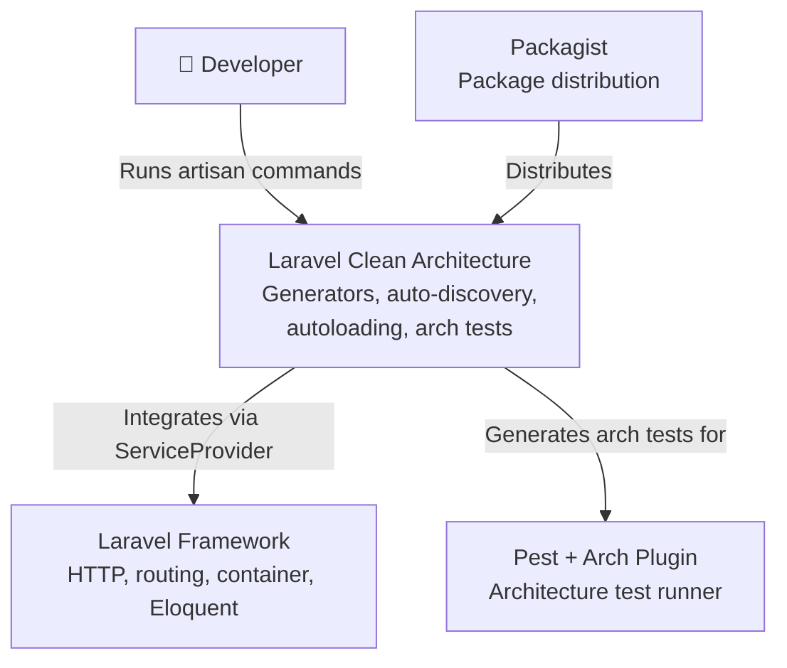
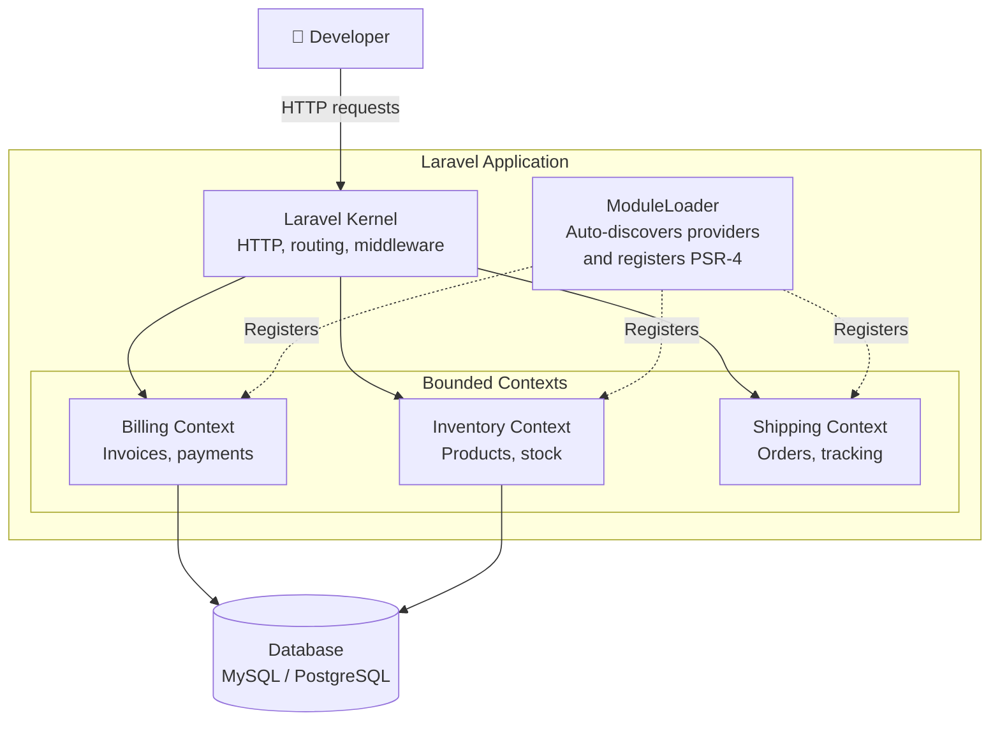
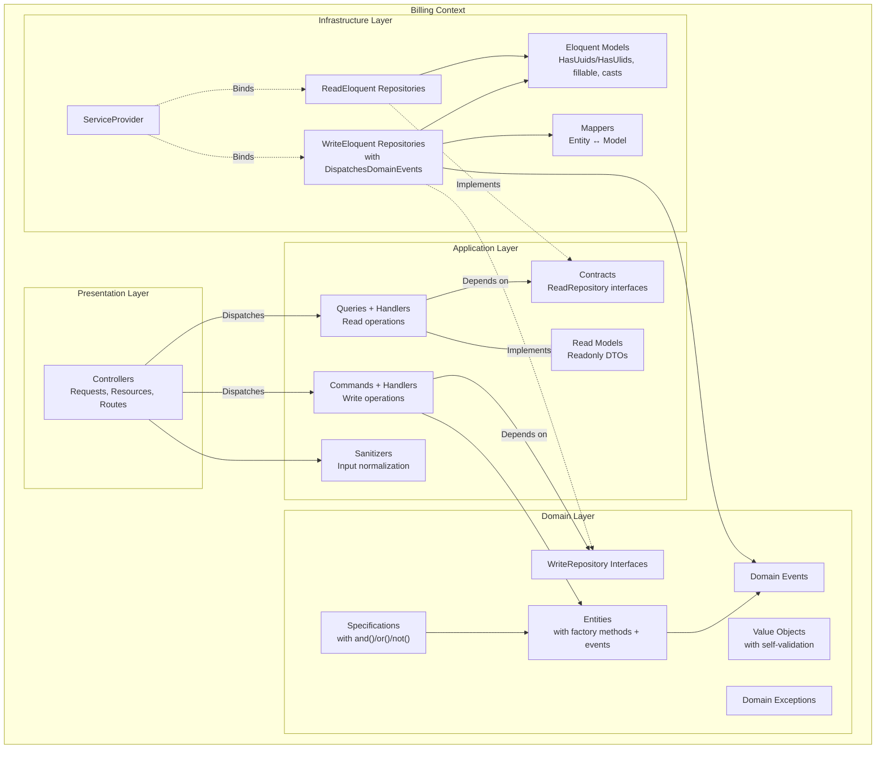
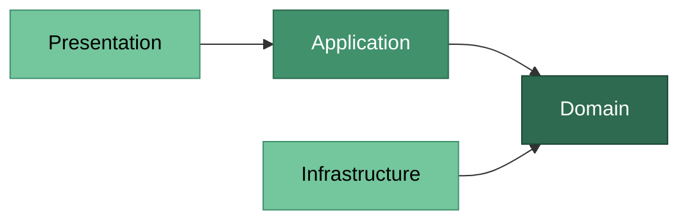

# Architecture Guide

> Part of [laravel-clean-architecture](../README.md) — the conceptual foundation behind what the generators produce.

## Architecture Overview

This package implements a layered architecture based on the principles of **Clean Architecture** (Robert C. Martin) and **Domain-Driven Design** (Eric Evans). The following diagrams illustrate how the pieces fit together.

### System Context

How the package fits into the Laravel ecosystem:



### Bounded Contexts

How multiple bounded contexts coexist inside a Laravel application:



### Layers Within a Context

The internal structure of a single bounded context and how layers communicate:



---

## Architecture Layers

Each bounded context is divided into four layers with strict dependency rules. The inner layers know nothing about the outer layers.

### Domain Layer

The **heart of the system**. Contains pure business logic with zero dependencies on frameworks, databases, or external services.

```
src/{Context}/Domain/
├── Entities/
├── ValueObjects/
├── Repositories/       # WriteRepository interfaces only
├── Specifications/
├── Events/
└── Exceptions/
```

#### Entities

Core business objects with a **unique identity** that persists over time. Two entities are equal if they share the same id, regardless of their attributes.

```php
namespace Src\Billing\Domain\Entities;

use CleanArchitecture\Support\HasDomainEvents;

final class Invoice implements HasDomainEvents
{
    private array $domainEvents = [];

    private function __construct(
        private readonly string $id,
    ) {
    }

    public static function create(string $id): self
    {
        return new self($id);
    }

    /** @internal Used only for persistence reconstitution */
    public static function fromPersistence(string $id): self
    {
        return new self($id);
    }

    public function id(): string
    {
        return $this->id;
    }

    private function recordEvent(object $event): void
    {
        $this->domainEvents[] = $event;
    }

    public function releaseEvents(): array
    {
        $events = $this->domainEvents;
        $this->domainEvents = [];
        return $events;
    }
}
```

| Characteristic | Rule |
|---------------|------|
| Identity | Every entity has a unique `id` |
| Constructor | `private` — forces creation through factory methods |
| Factory methods | `create()` for new entities, `fromPersistence()` for reconstitution from DB |
| Events | Implements `HasDomainEvents` — `recordEvent()` / `releaseEvents()` for domain event dispatch |
| Keyword | `final class` — prevents inheritance to protect invariants |
| Dependencies | Only `CleanArchitecture\Support` (allowed by architecture tests) |

#### Value Objects

**Immutable** objects defined by their attributes, not by an identity. Two value objects are equal if all their properties match.

```php
namespace Src\Billing\Domain\ValueObjects;

readonly class Money
{
    public function __construct(
        public string $value,
    ) {
        if (trim($value) === '') {
            throw new \InvalidArgumentException('Money cannot be empty.');
        }
    }

    public function equals(self $other): bool
    {
        return $this->value === $other->value;
    }

    public function __toString(): string
    {
        return $this->value;
    }
}
```

| Characteristic | Rule |
|---------------|------|
| Immutability | `readonly class` — cannot be modified after creation |
| Self-validation | Constructor rejects invalid state immediately |
| Equality | Compared by value via `equals()`, not by reference |
| Dependencies | None outside Domain layer |

#### Repository Interfaces (CQRS Split)

Repositories follow the **CQRS pattern**: write operations are separated from read operations. The **WriteRepository** lives in Domain, the **ReadRepository** lives in Application/Contracts.

```php
// Domain/Repositories — write operations only
namespace Src\Billing\Domain\Repositories;

use Src\Billing\Domain\Entities\Invoice;

interface InvoiceWriteRepository
{
    public function ofId(string $id): ?Invoice;
    public function save(Invoice $entity): void;
    public function delete(string $id): void;
}
```

```php
// Application/Contracts — read operations, returns ReadModels
namespace Src\Billing\Application\Contracts;

use CleanArchitecture\Support\PaginatedResult;
use Src\Billing\Application\ReadModels\InvoiceReadModel;

interface InvoiceReadRepository
{
    public function findById(string $id): ?InvoiceReadModel;

    /** @return PaginatedResult<InvoiceReadModel> */
    public function findAll(int $page = 1, int $perPage = 15): PaginatedResult;
}
```

| Characteristic | Rule |
|---------------|------|
| Type | `interface` — never a concrete class in Domain |
| Write | `save`, `delete` — works with entities |
| Read | `findById` returns nullable ReadModel, `findAll` returns `PaginatedResult` with items + metadata |
| Purpose | Decouples domain from persistence + enforces CQRS |
| Implementation | Lives in Infrastructure layer (Eloquent, API, etc.) |

#### Specifications

**Business rules as reusable, composable objects**. Each specification answers a single yes/no question about a domain object.

```php
namespace Src\Billing\Domain\Specifications;

use CleanArchitecture\Support\CompositeSpecification;

class InvoiceOverdueSpecification extends CompositeSpecification
{
    public function isSatisfiedBy(mixed $candidate): bool
    {
        // Business rule: is this invoice past its due date?
    }
}

// and()/or()/not() come from CompositeSpecification and return real
// composite objects, so specifications of different classes compose freely:
// $overdue->and($highValue)->or($flagged->not())
```

| Characteristic | Rule |
|---------------|------|
| Single rule | One specification = one business predicate |
| Composable | Specifications can be combined (and, or, not) |
| Reusable | Used by entities, handlers, or query filters |
| Dependencies | May depend on other Domain objects only |

---

### Application Layer

**Orchestrates use cases** by coordinating domain objects. Contains no business logic itself — it delegates to the Domain layer.

```
src/{Context}/Application/
├── Commands/
│   └── {Name}/
│       ├── {Name}Command.php
│       └── {Name}Handler.php
├── Queries/
│   └── {Name}/
│       ├── {Name}Query.php
│       └── {Name}Handler.php
├── Contracts/          # ReadRepository interfaces
├── ReadModels/         # Read models (readonly DTOs)
└── Sanitizers/         # Input sanitization
```

#### Commands (Write Operations)

A **Command** represents an intention to change state. It is a simple DTO (Data Transfer Object) carrying the data needed for the operation. The **Handler** executes the use case. The `--crud` flag generates CRUD-specific constructors and handler bodies.

```php
// Create command — receives sanitized data array
readonly class CreateInvoiceCommand
{
    public function __construct(
        public string $id,
        public array $data,
    ) {
    }
}

// Create handler — creates entity via factory method, saves via repository.
// The id is generated at the presentation edge and travels in the command,
// so the Application layer never imports the framework.
class CreateInvoiceHandler
{
    public function __construct(
        private readonly InvoiceWriteRepository $repository,
    ) {
    }

    public function handle(CreateInvoiceCommand $command): void
    {
        $entity = Invoice::create($command->id);

        // TODO: Apply $command->data to the entity before saving
        $this->repository->save($entity);
    }
}
```

> The generated controller produces the id with `Str::uuid7()` (or `Str::ulid()` with `--id-type=ulid`) and returns it in the `201` response with a `Location` header. See [Identifier Strategy](#the---id-type-flag).

```php
// Delete command — receives entity id
readonly class DeleteInvoiceCommand
{
    public function __construct(
        public string $id,
    ) {
    }
}

// Delete handler — delegates to repository
class DeleteInvoiceHandler
{
    public function __construct(
        private readonly InvoiceWriteRepository $repository,
    ) {
    }

    public function handle(DeleteInvoiceCommand $command): void
    {
        $this->repository->delete($command->id);
    }
}
```

| Component | Responsibility |
|-----------|---------------|
| `Command` | Immutable DTO with input data (what to do) |
| `Handler` | Executes the use case (how to do it) |
| Return | `void` — commands don't return data |
| `--crud` | Generates CRUD-specific constructor + handler body |

#### Queries (Read Operations)

A **Query** represents a request for data. The **Handler** fetches and returns a **ReadModel** — a flat, optimized representation of the data.

```php
// Query — immutable DTO with query parameters
namespace Src\Billing\Application\Queries\GetInvoice;

readonly class GetInvoiceQuery
{
    public function __construct(
        public string $id,
    ) {
    }
}

// Handler — fetches data via ReadRepository, injected via --entity flag
namespace Src\Billing\Application\Queries\GetInvoice;

use Src\Billing\Application\Contracts\InvoiceReadRepository;
use Src\Billing\Application\ReadModels\InvoiceReadModel;

class GetInvoiceHandler
{
    public function __construct(
        private readonly InvoiceReadRepository $repository,
    ) {
    }

    public function handle(GetInvoiceQuery $query): ?InvoiceReadModel
    {
        return $this->repository->findById($query->id);
    }
}
```

| Component | Responsibility |
|-----------|---------------|
| `Query` | DTO with query parameters (filters, pagination) |
| `Handler` | Fetches data, builds and returns a ReadModel from `Application/ReadModels/` |
| `ReadModel` | Readonly DTO optimized for the consumer (one per entity) |

For collection/list queries, the `--collection` flag generates a paginated variant:

```php
// List query — pagination instead of $id
namespace Src\Billing\Application\Queries\ListInvoices;

readonly class ListInvoicesQuery
{
    public function __construct(
        public int $page = 1,
        public int $perPage = 15,
    ) {
    }
}

// Handler — returns paginated result via repository
class ListInvoicesHandler
{
    public function __construct(
        private readonly InvoiceReadRepository $repository,
    ) {
    }

    public function handle(ListInvoicesQuery $query): PaginatedResult
    {
        return $this->repository->findAll($query->page, $query->perPage);
    }
}
```

#### Read Models

Read models in `Application/ReadModels/` are **reusable projections** shared across queries.

```php
namespace Src\Billing\Application\ReadModels;

readonly class InvoiceSummaryReadModel
{
    public function __construct(
        public string $id,
    ) {
    }
}
```

---

### Infrastructure Layer

**Implements interfaces** defined in the Domain layer. This is where frameworks, databases, APIs, and other external concerns live.

```
src/{Context}/Infrastructure/
├── {Context}ServiceProvider.php
├── Models/
│   └── {Name}Model.php
├── {Name}WriteEloquentRepository.php
├── {Name}ReadEloquentRepository.php
└── {Name}Mapper.php
```

#### Eloquent Repositories (CQRS)

Separate implementations for write and read operations:

```php
// Write — works with entities, dispatches domain events after persistence
namespace Src\Billing\Infrastructure;

use CleanArchitecture\Support\DispatchesDomainEvents;
use Src\Billing\Domain\Entities\Invoice;
use Src\Billing\Domain\Repositories\InvoiceWriteRepository;
use Src\Billing\Infrastructure\Models\InvoiceModel;

class InvoiceWriteEloquentRepository implements InvoiceWriteRepository
{
    use DispatchesDomainEvents;

    public function ofId(string $id): ?Invoice
    {
        $model = InvoiceModel::query()->find($id);

        return $model ? InvoiceMapper::toEntity($model) : null;
    }

    public function save(Invoice $entity): void
    {
        $data = InvoiceMapper::toArray($entity);
        InvoiceModel::query()->updateOrCreate(['id' => $entity->id()], $data);
        $this->dispatchDomainEvents($entity);
    }

    public function delete(string $id): void
    {
        InvoiceModel::destroy($id);
    }
}
```

```php
// Read — returns read models with pagination metadata
namespace Src\Billing\Infrastructure;

use CleanArchitecture\Support\PaginatedResult;
use Src\Billing\Application\Contracts\InvoiceReadRepository;
use Src\Billing\Application\ReadModels\InvoiceReadModel;
use Src\Billing\Infrastructure\Models\InvoiceModel;

class InvoiceReadEloquentRepository implements InvoiceReadRepository
{
    public function findById(string $id): ?InvoiceReadModel
    {
        $model = InvoiceModel::query()->find($id);

        return $model ? new InvoiceReadModel($model->id) : null;
    }

    /** @return PaginatedResult<InvoiceReadModel> */
    public function findAll(int $page = 1, int $perPage = 15): PaginatedResult
    {
        $total = InvoiceModel::query()->count();

        $items = InvoiceModel::query()
            ->forPage($page, $perPage)
            ->get()
            ->map(fn (InvoiceModel $model) => new InvoiceReadModel($model->id))
            ->all();

        return new PaginatedResult(items: $items, total: $total, page: $page, perPage: $perPage);
    }
}
```

#### Eloquent Model

Each scaffolded entity gets a dedicated Eloquent model with UUID (default) or ULID keys — see [Identifier Strategy](#the---id-type-flag). Table names are auto-computed from the entity name (`OrderItem` → `order_items`).

```php
namespace Src\Billing\Infrastructure\Models;

use Illuminate\Database\Eloquent\Concerns\HasUuids;
use Illuminate\Database\Eloquent\Model;

class InvoiceModel extends Model
{
    use HasUuids;

    protected $table = 'invoices';

    protected $fillable = [
        'id',
        // TODO: Add fillable columns
    ];
}
```

With `--id-type=ulid`, the same model is generated with `HasUlids` and the migration uses `$table->ulid('id')->primary()`.

#### Mapper

Bridges the gap between entities and Eloquent models:

```php
namespace Src\Billing\Infrastructure;

use Src\Billing\Infrastructure\Models\InvoiceModel;

final class InvoiceMapper
{
    public static function toArray(Invoice $entity): array
    {
        return ['id' => $entity->id(), /* ... */];
    }

    public static function toEntity(InvoiceModel $model): Invoice
    {
        return Invoice::fromPersistence(id: $model->id, /* ... */);
    }
}
```

#### Context ServiceProvider

Each bounded context has its own ServiceProvider where you **bind repository interfaces to implementations**. Routes are **automatically loaded** from `Presentation/Routes/` — both `api.php` and `web.php` are loaded if they exist. When you run `clean:scaffold`, bindings are **wired automatically** between the `// {bindings}` markers.

```php
namespace Src\Billing\Infrastructure;

class BillingServiceProvider extends ServiceProvider
{
    public function register(): void
    {
        // This provider is auto-discovered by the CleanArchitecture package.
        // No manual registration in bootstrap/providers.php is needed.

        // {bindings}
        $this->app->bind(InvoiceWriteRepository::class, InvoiceWriteEloquentRepository::class);
        $this->app->bind(InvoiceReadRepository::class, InvoiceReadEloquentRepository::class);
        // {/bindings}
    }

    public function boot(): void
    {
        $this->loadRoutes();  // loads api.php + web.php if they exist
    }
}
```

#### Domain Event Dispatching

Write repositories include the `DispatchesDomainEvents` trait, which dispatches domain events via Laravel's `event()` helper after entity persistence. Events recorded via `$entity->recordEvent()` are released and dispatched automatically when `save()` is called. The `releaseEvents()` method clears the entity's event list, preventing double dispatch.

```php
// In your entity (implements HasDomainEvents):
$invoice->recordEvent(new InvoicePaidEvent($invoice->id()));

// In your write repository (generated automatically):
$this->dispatchDomainEvents($entity); // called after save

// Listen with standard Laravel listeners:
Event::listen(InvoicePaidEvent::class, SendInvoiceReceipt::class);
```

The trait checks for the `HasDomainEvents` interface, so it works safely with any entity — those that don't implement the interface are silently skipped.

---

### Presentation Layer

**Entry point for external input**. Contains controllers, form requests, API resources, and route definitions. Delegates all logic to the Application layer.

```
src/{Context}/Presentation/
├── Controllers/
├── Requests/
├── Resources/
└── Routes/
    ├── api.php          # generated by default
    └── web.php          # generated with --routes=web or --routes=both
```

#### Controllers

Handle HTTP requests and delegate to Application layer commands/queries. When generated via `clean:scaffold` or `clean:controller --entity`, the controller comes **pre-wired** with all 5 CQRS handlers and working implementations for every RESTful method:

```php
namespace Src\Billing\Presentation\Controllers;

use Src\Billing\Application\Commands\CreateInvoice\{CreateInvoiceCommand, CreateInvoiceHandler};
use Src\Billing\Application\Commands\UpdateInvoice\{UpdateInvoiceCommand, UpdateInvoiceHandler};
use Src\Billing\Application\Commands\DeleteInvoice\{DeleteInvoiceCommand, DeleteInvoiceHandler};
use Src\Billing\Application\Queries\GetInvoice\{GetInvoiceHandler, GetInvoiceQuery};
use Src\Billing\Application\Queries\ListInvoices\{ListInvoicesHandler, ListInvoicesQuery};
use Src\Billing\Application\Sanitizers\InvoiceSanitizer;

class InvoiceController extends Controller
{
    public function __construct(
        private readonly CreateInvoiceHandler $createHandler,
        private readonly UpdateInvoiceHandler $updateHandler,
        private readonly DeleteInvoiceHandler $deleteHandler,
        private readonly GetInvoiceHandler $getHandler,
        private readonly ListInvoicesHandler $listHandler,
    ) {
    }

    public function index(Request $request): JsonResponse
    {
        $result = $this->listHandler->handle(new ListInvoicesQuery(
            page: (int) $request->query('page', 1),
            perPage: (int) $request->query('per_page', 15),
        ));

        return InvoiceResource::collection($result->items)
            ->additional(['meta' => $result->meta()])
            ->response();
    }

    public function show(string $id): JsonResponse
    {
        $readModel = $this->getHandler->handle(new GetInvoiceQuery($id));
        abort_if(! $readModel, 404);

        return (new InvoiceResource($readModel))->response();
    }

    public function store(InvoiceRequest $request): JsonResponse
    {
        $id = (string) Str::uuid7();
        $sanitized = InvoiceSanitizer::sanitize($request->validated());
        $this->createHandler->handle(new CreateInvoiceCommand($id, $sanitized));

        return response()->json(['id' => $id], 201)
            ->header('Location', $request->url() . '/' . $id);
    }

    public function update(InvoiceRequest $request, string $id): Response
    {
        $sanitized = InvoiceSanitizer::sanitize($request->validated());
        $this->updateHandler->handle(new UpdateInvoiceCommand($id, $sanitized));

        return response()->noContent();
    }

    public function destroy(string $id): Response
    {
        $this->deleteHandler->handle(new DeleteInvoiceCommand($id));

        return response()->noContent();
    }
}
```

Without `--entity`, the controller generates with TODO placeholders for all methods.

#### Form Requests

Validate incoming HTTP data before it reaches the Application layer.

```php
namespace Src\Billing\Presentation\Requests;

use Illuminate\Foundation\Http\FormRequest;

class InvoiceRequest extends FormRequest
{
    public function authorize(): bool
    {
        // TODO: Implement authorization
        return true;
    }

    public function rules(): array
    {
        return [
            // 'name' => ['required', 'string', 'max:255'],
        ];
    }
}
```

#### API Resources

Transform read models into JSON responses:

```php
namespace Src\Billing\Presentation\Resources;

use Illuminate\Http\Resources\Json\JsonResource;

class InvoiceResource extends JsonResource
{
    public function toArray($request): array
    {
        return [
            'id' => $this->id,
            // 'name' => $this->name,
            // 'created_at' => $this->created_at?->toISOString(),
        ];
    }
}
```

#### Routes

Each context has its own route files at `Presentation/Routes/`, automatically loaded by the context's ServiceProvider. Both `api.php` (with `api` middleware) and `web.php` (with `web` middleware) are loaded if they exist. The route prefix is derived from the context name in kebab-case.

When you run `clean:scaffold`, a resource route is **wired automatically** between the `// {routes}` markers — `Route::apiResource()` for `api.php` and `Route::resource()` for `web.php`:

```php
// src/Billing/Presentation/Routes/api.php
use Illuminate\Support\Facades\Route;
use Src\Billing\Presentation\Controllers\InvoiceController;

Route::prefix('billing')->group(function () {
    // {routes}
    Route::apiResource('invoices', InvoiceController::class);
    // {/routes}
});
```

For a multi-word context like `OrderManagement`, the prefix becomes `order-management`. Use `--routes=web` or `--routes=both` with `clean:context` to generate web route files.

---

## The Dependency Rule

The most important rule in Clean Architecture: **dependencies only point inward**.



| Rule | Enforced by |
|------|-------------|
| Domain does not depend on Application | Architecture test |
| Domain does not depend on Infrastructure | Architecture test |
| Application does not depend on Presentation | Architecture test |
| Application does not depend on Infrastructure | Architecture test |
| Entities are `final` | Architecture test |
| Repository interfaces are `interface` | Architecture test |
| Value Objects are `readonly` | Architecture test |
| Infrastructure implements Domain interfaces | Convention (stubs) |

The generated architecture tests **automatically enforce these rules** in your CI pipeline.
